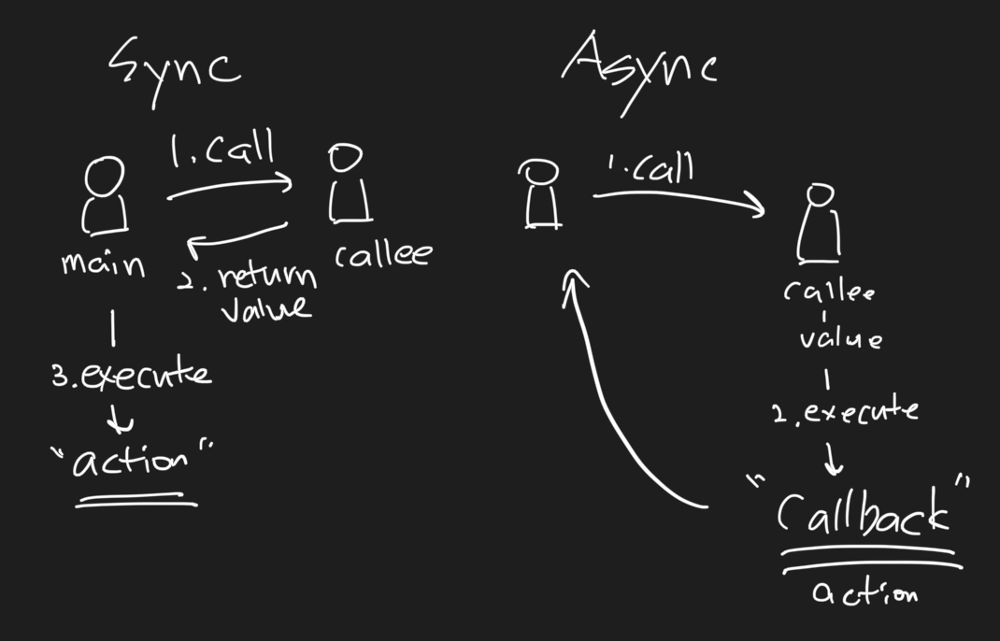

# 자바 동기,비동기 그리고 블로킹,논블로킹

> **함수가 다른 함수를 호출하는 상황일 때**
>
> - Caller : 호출하는 함수를 의미한다.
> - Callee : 호출 당하는 함수를 의미한다.
>

## 동기와 비동기



#####  동기 Sync

- caller는 callee의 결과를 이용해서 action을 수행한다. (caller는 callee의 결과를 알아야 함 -> caller와 callee는 동기화 됨)

#####  비동기 Async

- caller는 callee를 호출하고 callee가 알아서 callback(=action)을 수행한다. (caller는 callee의 결과와 상관이 없음 -> caller와 callee는 비동기)

## 블로킹과 논블로킹

##### 블로킹 Blocking

> Thread.sleep 걸었을 때 이보다 밑에 코드는 sleep 시간 이후에 작동 된다.

*쓰레드 차단이 일어난다, 컨텍스트 스위칭 비용이 발생한다, 명령형 프로그래밍*

- callee를 호출한 후, callee가 완료될 때까지 caller는 아무런 작업을 하지 못하고 기다린다. -> 블로킹된 상태
- 따라서 제어권을 callee가 가지게 된다.
- 블로킹은 대게 thread가 작업량이 많아 오랜 시간 작업을 하거나 대기 하는 경우 발생하게 된다.
  - CPU-Bound Blocking : 작업을 오래 해서 발생하는 블로킹, 추가적인 리소스(코어)를 투입해서 작업을 빨리처리하게 하여 해결해야함
  - IO-Bound Blocking : 오랜 시간 대기하여 발생하는 블로킹, 파일 읽기/쓰기, 네크워크 요청 등으로 인한 대기 -> IO-Non-Blocking도 가능
- 블로킹은 전파가 된다! -> 블로킹 함수 안에 논블로킹, 블로킹 함수가 있을 때 논블로킹 함수가 먼저 작업이 끝나도 블로킹 함수가 끝나기 전까지는 같이 블로킹 된다. 즉, 해당 thread의 작업이 완료될 때 까지 thread는 차단되어 대기한다.(ex. 외부 시스템 api 호출하고 응답을 받아 낼 때까지 기다린다는 뜻)
- 요청 하나당 하나의 thread를 생성하여 할당 (Thread Pool을 이용하여 생성 비용 절감), 더이상 thread를 생성하지 못하면 대기
- thread 차단을 보완하기 위해 멀티 쓰레딩 기법을 이용, 하지만 context switching 으로 인한 스레드 전환 비용 발생

##### 논블로킹 Non-Blocking

> Thread.sleep 걸었을 때 이보다 아래 작성된 코드는 sleep 시간이 오기 전에 먼저 작동이 되어 버린다. thread 차단이 되지 않기 때문.

*쓰레드 차단이 발생하지 않는다, 선언형 프로그래밍*

- caller는 callee를 기다리지 않고 본인의 일을 함, 작업 thread의 종료 여부와 관계없이 요청 thread는 차단되지 않음(ex. 외부 시스템 api 호출하고 기다리는 게 아니라 다른 작업을 계속 한다는 뜻)
- 제어권을 caller가 가지게 된다.
- Blocking보다 적은 thread를 사용하므로 효율적으로 CPU 사용 가능
- 하나의 thread가 Blocking보다 더 많은 요청을 처리할 수 있음, thread가 차단되지 않기 때문에

### 동기와 비동기, 블로킹과 논블로킹은 같은 개념일까?

> caller가 callee를 호출하고 다른 본인의 일을 할 수도 있기 때문에 동기-비동기와 블로킹-논블로킹은 같은 선상에서 비교할 수 있는 개념이 아님<br/>ex) caller가 callee를 호출하고 caller는 callee가 작업이 끝날 때까지 상태를 물어보면서 로그를 찍는등(동기-논블로킹인 상황)
>
> 동기 - 블로킹, 비동기 - 논블로킹이 무조건 동시에 일어나는 상황은 아니라는 점 상황에 따라 비동기 - 블로킹도 가능하다!

## Context Switching

현재 실행중인 프로세스의 정보는 CPU의 레지스터에 저장되는데 이러한 프로세스들이 번갈아 가면 실행되는 과정에서 PCB(Process Control Block)에 저장된 프로세스 정보가 레지스터에 지속적으로 저장되어 그 값이 변경되는 것을 의미함, 컨텍스트 스위칭이 일어나면 스레드 전환 비용이 발생함<br/>

실제 컴퓨터는 여러 프로세스를 동시에 실행하는 게 아니라 컨텍스트 스위칭을 통해 여러 개의 프로그램을 번갈아 가며 실행시켜 준다. 하지만 이러한 스위칭은 인간의 눈으로는 인지하기에는 엄청 빠르므로 여러 개의 프로그램이 동시에 실행시키는 것처럼 보이는 것일 뿐이다. <br/>

**스레드의 컨텍스트 스위칭**<br/>

멀티스레딩도 마찬가지로 여러 개의 스레드가 동시에 실행되는 것이 아니라 번갈아 가면서 실행되는 것이다. 따라서 스레드 간의 컨텍스트 스위칭이 발생함. 다만 스레드는 프로세스에 종속된 하위 개념이고 비교적 적은 정보만을 스위칭하므로 프로세스 간의 스위칭 보다 비용이 덜 든다.

## CompletableFutre

> java 8 에서 도입된 비동기 프로그래밍 지원 기능으로 Future와 CompletionStage를 구현한 구현체이다.

### [Future](https://docs.oracle.com/javase/8/docs/api/java/util/concurrent/Future.html)

- 비동기적인 작업을 수행하고, 해당 작업이 완료되면 결과를 반환하는 인터페이스이다. 
- java 5 에서의 Future는 비동기의 결과값을 조합하거나, error를 핸들링할 수 없었다. 
  - cancel을 제외하고 Future객체 외부에서 컨트롤하는 기능이 없고 get을 통해 반환된 결과로 값에 접근하기 때문에 비동기 처리가 어렵다는 문제점이 있다. 또한 상태값 구분이 어려움(완료가 된건지 에러가 발생한건지 취소된건지..)

- 이후 자바 8에서 CompletionStage가 등장하였고, 비동기 연산 Step을 통해 계속 체이닝 형태로 조합이 가능해졌고 이를 통해 앞선 문제점들을 해결했다. 그리고 Future와 CompletionStage를 구현한 CompletableFutre도 같이 추가되었다.

*Future의 주요 메서드*

```java
public interface Future<V> {
  boolean cancel(boolean mayInterruptIfRunning); // 취소할 수 없는 상황이라면 false가 반환된다, mayInterruptIfRunning가 false일 경우 시작하지 않은 task에 대해서만 취소한다.
  boolean isCancelled(); // task가 명시적으로 취소되었을 경우에 true 반환
  boolean isDone(); // task가 완료되었다면, 원인과 상관없이 true 반환
  V get() throws InterruptedException, ExecutionException; // 결과가 도출될 때까지 쓰레드 block
  V get(long timeout, TimeUnit unit) throws InterruptedException, ExecutionException, TimeoutException; // timeout 시간 까지만 기다린다. 즉, 앞선 get처럼 무한히 쓰레드가 block되는게 아니라 timeout 시간까지만 block됨 - TimeoutException 발생
}
```

### [CompletionStage](https://docs.oracle.com/javase/8/docs/api/java/util/concurrent/CompletionStage.html)

- 하나의 비동기 작업을 수행하고 완료되었을 때 그 결과를 가지고 또 다른 작업을 수행하거나 다른 CompletionStage를 연결하는 명령들이 있는 인터페이스
- 에러 처리를 위한 콜백함수 제공

*CompletionStage의 주요 메서드 - 반환값이 CompletionStage이므로 체이닝이 가능하게 설계되어 있다.* 

```java
public interface CompletionStage<T> {
  public <U> CompletionStage<U> thenApply(Function<? super T, ? extends U> fn);
  public <U> CompletionStage<U> thenApplyAsync(Function<? super T, ? extends U> fn);
 
  public CompletionStage<Void> thenAccpet(Consumer<? super T> action);
  public CompletionStage<Void> thenAcceptAsync(Consumer<? super T> action);
  
  public CompletionStage<Void> thenRun(Runnable action);
  public CompletionStage<Void> thenRunAsync(Runnable action);
  
  // compose는 추상메서드X default 메서드임
  public <U> CompletionStage<U> thenCompose(Function<? super T, ? extends CompletionStage<U>> fn);
  public <U> CompletionStage<U> thenComposeAsync(Function<? super T, ? extends CompletionStage<U>> fn);
  
  public CompletionStage<T> exceptionally(Function<Throwable, ? extends T> fn);
}
```

then[Async] 메서드 중 async가 붙으면 쓰레드 풀에 있는 쓰레드에서 action을 실행하지만 안 붙은 경우에는 stage의 상태가 isDone이면 then함수를 호출한 caller 쓰레드에서 action을 실행하고 isDone이 아니라면 then함수가 호출된 callee의 쓰레드에서 action을 실행하여 예측이 어렵다는 문제가 있다. -> caller와 callee가 블로킹 되는 등의 문제가 발생할 수 있으므로 async 붙은걸 쓰는것을 권장?

### [CompletableFutre](https://docs.oracle.com/javase/8/docs/api/java/util/concurrent/CompletableFuture.html)

```java
public class CompletableFutre<T> implements Future<T>, CompletionStage<T> {
  public static <U> CompletableFuture<U> supplyAsync(Supplier<U> supplier){ ... }
  public static CompletableFuture<Void> runAsync(Runnable runnable){ ... }
  
  public boolean complete(T value){ ... }
  public boolean isCompletedExceptionally(){ ... }
  
  public static CompletableFuture<Void> allOf(CompletableFuture<?>... cfs){ ... }
  public static CompletableFuture<Object> anyOf(CompletableFuture<?>... cfs){ ... }
}
```

- `supplyAsync ` : Supplier를 제공하여 CompletableFuture를 생성하고 CompletableFuture의 결과를 반환
- `runAsync` : Runnable를 제공하여 CompletableFuture를 생성하고 값을 반환하지는 않는다.
- `complete` : CompletableFuture가 완료되지 않았다면 주어진 값으로 변경하고 complete에 의해 상태가 바뀌었다면 true반환
- `isCompletedExceptionally` : 예외에 의해 complete 되었는지 확인, 이전의 Future에서는 할 수 없었던 부분
- `allOf` : 여러 개의 CompletableFuture를 모아서 하나의 CompletableFuture로 반환한다. 모든 CompletableFuture가 완료될 경우 done으로 상태를 변경함. -> 즉, allOf는 각 CompletableFuture이 각각의 쓰레드에서 작업을 진행한후 모두 작업이 완료된 상태의 시점에서 모아준다. 반환값이 void이므로 각 CompletableFuture의 결과값은 각 get으로 값을 가져오면 됨
- `anyOf` : 주어진 CompletableFuture 중 하나라도 완료되면 상태가 done으로 변경하고 그 값을 반환한다. -> 모두가 작업이 끝난 후 모아주는 allOf와 달리 가장 빨리 작업을 끝마친 결과를 도출해준다.

#### CompletableFuture의 한계

- CompletableFuture를 반환하는 함수를 호출 즉시 작업이 실행되므로, 지연로딩이 어렵다.
- CompletableFuture에서 데이터를 반환한 후, 다시 다른 값을 전달하기가 어려워서 지속적으로 생성되는 데이터를 처리하기 어렵다.

### ExecutorService

- 쓰레드 풀을 이용하여 비동기적으로 작업을 실행하고 관리하는 서비스
- 쓰레드 풀을 이용하여 자원을 관리하므로 직접 별도의 쓰레드를 생성하고 관리하지 않아도 된다. 
- 따라서 코드를 간결하게 유지 가능하다.

*ExecutorService의 주요 메서드*

```java
public interface ExecutorService extends Executor {
  void execute(Runnable command); // Runnable 인터페이스를 구현한 객체를 쓰레드 풀에서 비동기적으로 수행한다.
  <T> Future<T> submit(Callable<T> task); // Callable 인터페이스를 구현한 객체를 쓰레드 풀에서 비동기적으로 수행하고, 그 결과를 반환한다.
  void shutdown(); // ExecutorService를 종료하고, 더이상의 task를 받지 않는다.
}
```


### Method reference

- `::`연산자를 통해 함수에 대한 참조를 나타낸다.
  - method reference
  - static method reference
  - instance method reference
  - constructor method reference
