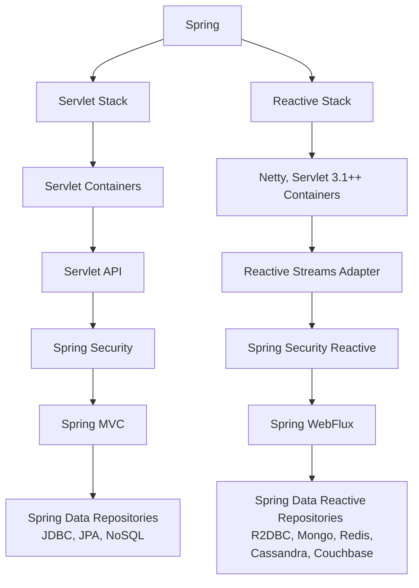

# WebFlux

## Reactive Streams

>  비동기 데이터 스트림 처리를 위한 표준으로, 메커니즘은 Publisher가 Subscriber에게 비동기적으로 이벤트를 전달하는 방식이다.

[더보기](https://github.com/kimzerovirus/TIL/blob/main/jvm%EC%96%B8%EC%96%B4/Java/%EB%A6%AC%EC%95%A1%ED%8B%B0%EB%B8%8C%EC%8A%A4%ED%8A%B8%EB%A6%BC.md)

## WebFlux Stack과 MVC Stack 비교



Spring MVC에서의 Security는 서블릿 필터를 이용한 Spring Security가 서블릿 컨테이너와 통합되는 반면 WebFlux에서는 WebFilter를 이용한다.

## WebFlux의 요청 처리 흐름 

1. Netty, Jetty, Undertow와 같은 서버 엔진을 거쳐 HttpHandler가 들어오는 요청을 전달 받는다.
2. 각 서버 엔진으로부터 받은 ServerHttpRequest와 ServerHttpResponse를 포함한 ServerWebExchange를 생성한 후, WebFilter체인으로 전달한다.
3. ServerWebExchange는 WebFilter에서 전처리 과정을 거친 후 WebHandler의 구현체인 DispatcherHandler에게 전달한다.
4. Spring MVC의 DispatcherServlet과 유사한 역할을 하는 DispatcherHandler는 HandlerMapping리스트를 원본 Flux의 소스로 전달받는다.
5. ServerWebExchange를 처리할 핸들러를 조회하고 조회된 핸들러의 호출을 HandlerAdapter에게 위임한다.
6. HandlerAdapter는 처리할 (위임받은)핸들러를 호출한다.
7. Controller 또는 HandlerFunction 형태의 핸들러에서 요청을 처리한 후, 응답 데이터를 반환한다.
8. 핸들러로부터 반환받은 응답 데이터를 처리할 HandlerResultHandler를 조회한다.
9. 조회된 HandlerResultHandler가 응답 데이터를 적절하게 처리한 후 response를 반환한다.

### HttpHandler

HTTP 서버로 부터 request와 response 처리를 위한 단하나의 인터페이스를 제공한다.

구현체로는 HttpWebHandlerAdapter가 있다.

```java
public interface Httphandler {
  Mono<Void> handle(ServerHttpRequest request, ServerReposne response);
}
```

### WebFilter

MVC의 서블릿 필터와 같이 핸들러 요청을 처리하기 전의 전처리 작업을 한다. 주로 시큐리티 관련, 세션 타임아웃 등의 전처리 작업 수행

### DispatcherHandler

DispatcherServlet과 마찬가지로 먼저 요청을 전달받은 후 다른 컴포넌트로 요청 처리를 위임한다.

### WebFlux가 스레드 차단 없이 더 많은 요청을 처리할 수 있는 이유

> **이벤트 루프 방식**을 이용한 Non-Blocking 프로세스이기 때문이다.

1. 클라 --요청--> 요청 핸들러가 전달받는다.
2. 전달받은 요청을 이벤트 루프에 넣는다.
3. 이벤트 루프는 작업들에 콜백을 등록한다.
4. 작업이 완료되면 완료 이벤트를 이벤트 루프에 넣는다.
5. 미리 등록해뒀던 콜백을 호출해 처리 결과를 전달한다.

### WebFlux와 MVC의 스레드 비교

MVC에서는 요청이 들어오면 스레드 풀이라는 것을 이용해 미리 생성되어 있는 스레드가 요청을 처리하고 요청 처리를 완료하면 다시 스레드 풀에 스레드 풀을 반납하여 사용하는 형식이다. 따라서 요청 하나당 하나의 스레드를 할당해야하기 때문에 많은 요청을 처리하려면 많은 수의 스레드가 필요하다.<br/>

WebFlux에서는 비교적 적은 수의 고정된 크기의 스레드(일반적으로 CPU 코어 개수만큼 스레드를 생성해둔다.)를 생성해서 Non-Blocking방식으로 대량의 요청을 처리한다.

## Spring WebMVC와 WebFlux 차이점과 2개의 의존성이 모두 존재한다면 어떻게 동작할까?
- WebMVC: 전통적인 멑리 쓰레드 기반의 동기 blocking 기반의 웹프레임워크
  - 사용자 요청마다 스레드를 계속 생성하는 문제
  - 한정적인 스레드 풀의 개수로 인한 문제들..
- WebFlux: 리액티브 스택 기반의 non-blocking 웹프레임워크
  - 모든 코드가 논블로킹 해야 된다
  - 그에 따른 높은 러닝커브..

> 결론부터 말하자면 WebMVC 방식으로 동작하게 된다.

스프링 애플리케이션은 구동시에 NONE(웹 애플리케이션이 아닌 경우), SERVLET(서블릿 웹 애플리케이션인 경우), REACTIVE(리액티브 웹 애플리케이션인 경우) 3가지 타입 중 하나를 선택하여 동작한다. 그런데 만약 MVC, WebFlux 2가지 의존성이 모두 있을 경우에는 다음과 같다.
```java
// WebApplicationType.java
static WebApplicationType deduceFromClasspath() {
    if (ClassUtils.isPresent(WEBFLUX_INDICATOR_CLASS, null) 
        && !ClassUtils.isPresent(WEBMVC_INDICATOR_CLASS, null)
        && !ClassUtils.isPresent(JERSEY_INDICATOR_CLASS, null)) {
            return WebApplicationType.REACTIVE;
    }
    for (String className : SERVLET_INDICATOR_CLASSES) {
        if (!ClassUtils.isPresent(className, null)) {
            return WebApplicationType.NONE;
        }
    }
    return WebApplicationType.SERVLET;
}
```
서블릿 읜존성인 WebMVC가 존재하지 않아야만 REACTIVE 의존성인 WebFlux가 동작하게 설정되어 있다.
