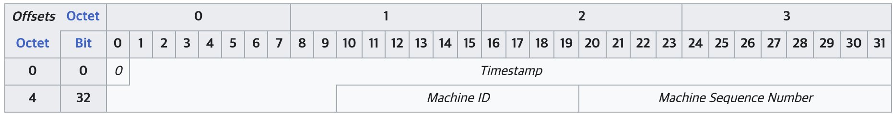

# ID 뭐로 만들지

## DB 자동증가 ID - sequence, auto increment

- Oracle sequence, MySQL auto increment
- DB가 알아서 ID 값을 순서대로 생성한다.
  - 트래픽이 정말 정말 매우 높으면 값 생성 부하도 클 수 있음
  - 반드시 순서대로는 아님
    - 예) Oracle RAC에서 시퀀스 사용 (각각의 DB 대수만큼 ID 범위를 나눠서 부여 받는다)
- 8 바이트 / 4바이트

## UUID

- universally unique identifier
- 자바 기준 v4 - 임의의 값을 생성한다. (라고는 하지만 컴퓨터에서의 임의의는 현재 시간을 베이스로 생성하는걸로 기억)
- (거의) 중복될 가능성이 없음
- 36글자, 32개(16진수) + "-" 4개, 128 비트
  - 예) a4850ea9-3992-4177-9b9a-c18ce6d8aff1
  - 바이너리로 저장하면 16비트
- 서버에서 생성하므로 ID 생성에 따른 DB 부하는 없음
- 분산 환경에 적합하다 할 수 있으나.. (MSA 플잭에서 많이 쓴듯?)

##### 클러스터형 인덱스 (Clustered Index)

> 키 값을 기준으로 데이터를 정렬하여 저장한다. 주로 PK가 클러스터형 인덱스이다.

랜덤하게 생성되는 UUID의 경우, INSERT 과정에서 인덱스/데이터의 이동이 더 많이 발생하여 효율이 떨어질지도.. (데이터가 들어올때 마다 계속 정렬하며 데이터가 이리저리 널뛰기 할 수 밖에 없음)

## UUIDv7

> 앞서 나온 클러스터형 인덱스 문제를 보완함

- 앞자리(48비트)에 타임스탬프가 들어감
- 시간 기준 (거의) 정렬된 순서로 생성
- 따라서 클러스터형 인덱스에 적합
- v4와 마찬가지로 36글자에 바이너리로 변환시 16비트이다.
  - 규모가 작은 곳에서는 문제 없음
  - 그런데 규모가 작으면 시퀀스, 자동증가 써도 효율 좋음
- 규모가 크면 ID가 차지하는 데이터 공간도 큼

## Snowflake

> 64비트 (8바이트) ID로 구 트위터 시절 만듦

- 부호비트(1) : 사용하지 않음 (예약)
- 타임스탬프(41) : 밀리초로 시간 표현 시작 시점부터 대략 70년 사용 가능
  - 부호비트까지 확장하면 139년 사용 가능
- 머신 ID(10) : 2^10 (1024개 가능) - 개별 프로세스 단위로 할당
- 시퀀스(12) : 2^12 (4096개 가능) 카운터로 매 밀리초마다 0으로 초기화
  - 한 머신 ID 기준 초당 약 40만개 (4,096,000) ID 생성이 가능하다.
- Mastodon, Snowflake, TSID 등 변형들...

###### 영상 링크

https://www.youtube.com/watch?v=gKbGIA7njQo&t=3s