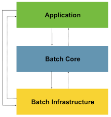

# Spring Batch

## 배치 핵심 프로세스

- Read : 데이터베이스, 파일 등에서 다량의 데이터를 조회한다.
- Process : 읽어들인 데이터를 가공한다.
- Write : 가공된 데이터를 저장한다.

## 배치 시나리오

- 주기적인 배치 프로세스 작업
- 동시 다발적인 Job의 배치 처리 및 대용량 병렬(멀티쓰레드) 처리
- 실패 후 수동 또는 스케줄링에 의한 재시작
- 의존관계에 있는 step 여러 개를 순차적으로 처리
- 경우에 따라서는 step을 순차적으로만 진행하지 않고 로직(Flow 구성)에 따라 다음 step을 실행한다.
- 반복 작업, 재시도, Skip 처리

## 스프링 배치 아키텍처

- Application Layer : 스프링 배치 프레임워크를 이용하여 개발자는 업무 로직 구현에 집중하고, 배치 Job 등의 기술 구현 등은 프레임웍에 위임한다.
- Batch Core : Job의 실행, 모니터링, 관리하는 API들로 구성되어 있다. (Job의 설정 구성)
  - JobLauncher, Job, Step, Flow 등
- Batch Infrastructure : Job 실행의 흐름과 처리를 위한 환경, 틀을 제공한다. (Core에서 구성된 Job을 실행 및 중단, 복구 등의 작업을 진행)
  - Reader, Processor Writer, Skip, Retry

출처: https://docs.spring.io/spring-batch/reference/spring-batch-architecture.html

